# GRIDTRUST

**Uncertainty-Aware Electricity Demand Forecasting with Conformal
Prediction**

GRIDTRUST is an end-to-end machine learning system that forecasts
electricity demand for multiple U.S. power grid regions while
quantifying forecast uncertainty. Instead of producing only point
forecasts, GRIDTRUST generates calibrated prediction intervals using
Conformal Prediction, helping users understand **how reliable each
forecast is**.

The project combines data engineering, machine learning, automation,
monitoring, reporting, and visualization into a single production-style
workflow.

---

## Why GRIDTRUST?

Forecast accuracy alone is not enough for real-world decision making.

Power system operators need to know:

- What demand is expected?
- How confident is the prediction?
- Is the forecasting system performing as expected?
- Can the entire workflow run automatically without manual
  intervention?

GRIDTRUST answers these questions by combining probabilistic forecasting
with automated reporting and monitoring.

---

## Features

- Automated electricity demand ingestion from the U.S. Energy
  Information Administration (EIA)
- Feature engineering for time-series forecasting
- LightGBM quantile regression models
- Distribution-free Conformal Prediction intervals
- Forecast coverage monitoring
- AI-generated executive summaries using Google Gemini
- Automated HTML email reports
- Interactive Streamlit dashboard
- GitHub Actions workflow automation
- PostgreSQL-backed data storage

---

## System Architecture

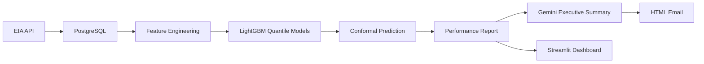

---

## Dashboard

The GRIDTRUST dashboard provides an interactive interface for monitoring electricity demand forecasts, evaluating model performance, and tracking the forecasting pipeline.

### Overview

The overview page presents a high-level summary of the forecasting system, including data availability, pipeline status, and overall system metrics.

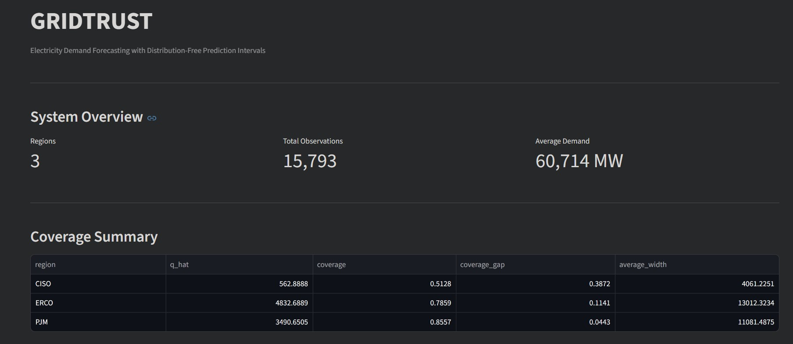

---

### Forecast Explorer

The Forecast Explorer allows users to inspect historical electricity demand, forecast intervals, and region-specific predictions.

#### Controls & Summary

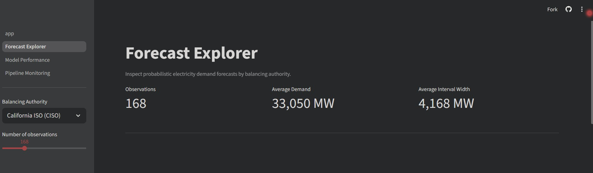

#### Forecast Visualization

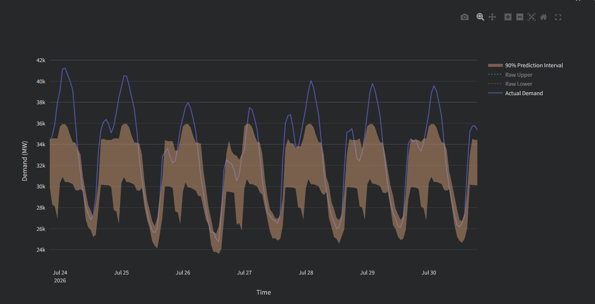

---

### Model Performance

The Model Performance page evaluates forecast reliability using conformal prediction metrics and interval diagnostics.

#### Performance Overview

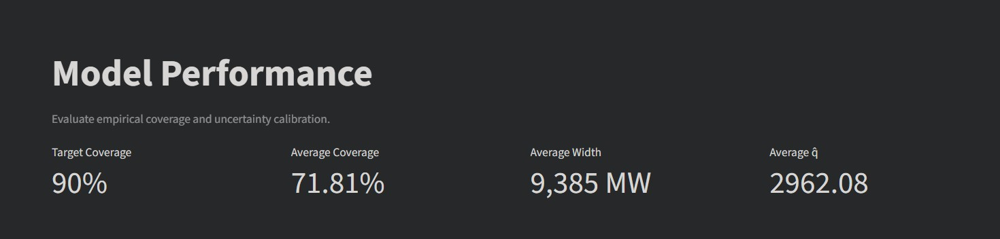

#### Coverage & Interval Analysis

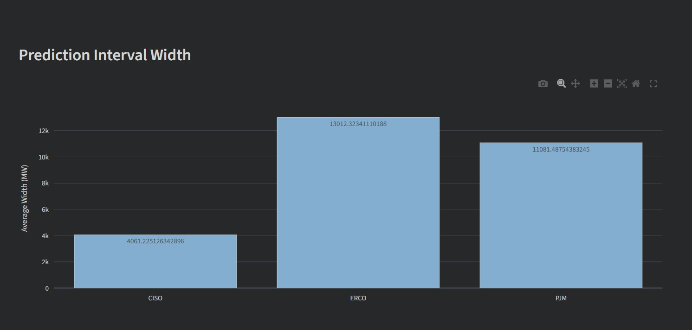

---

### Pipeline Monitoring

The Pipeline Monitoring page tracks the operational status of the automated forecasting workflow.

#### Pipeline Overview

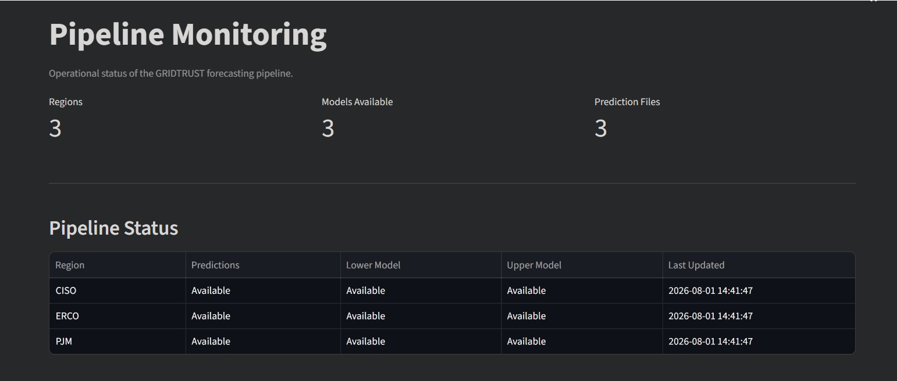

#### Pipeline Details

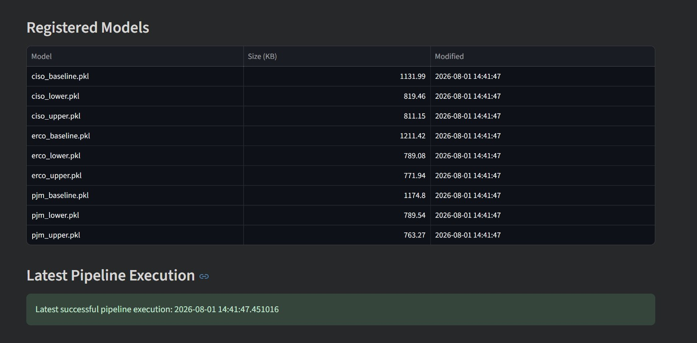

---

## Automated Email Report

After every scheduled pipeline execution, GRIDTRUST automatically generates and emails a comprehensive forecasting report.

### Report Summary

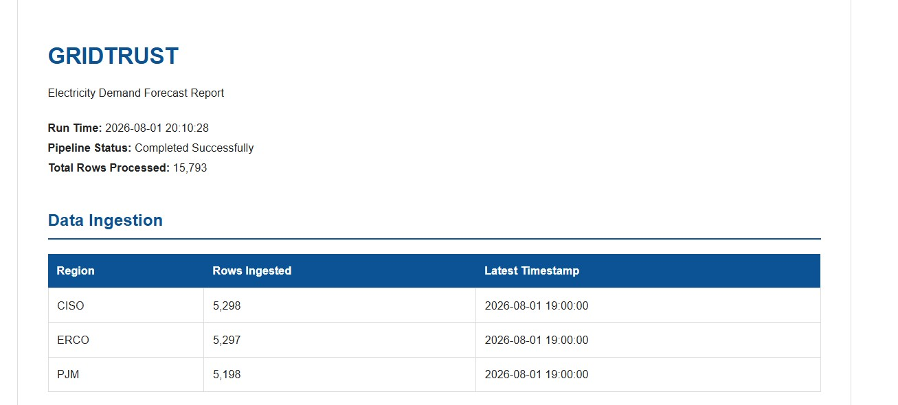

### Forecast & Performance Results

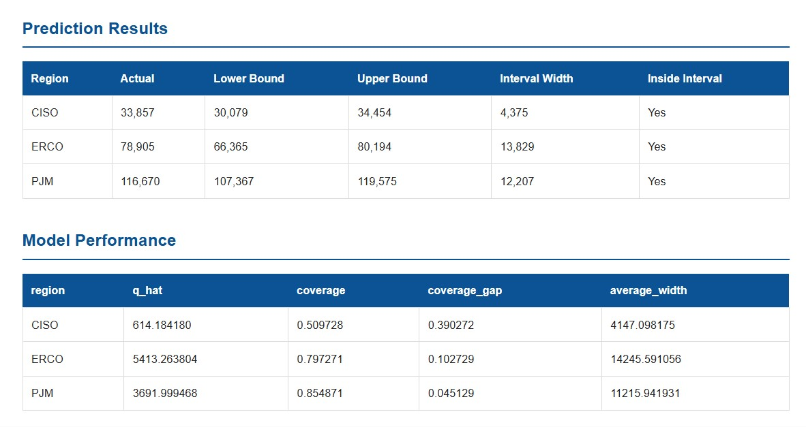

### AI Executive Summary

## 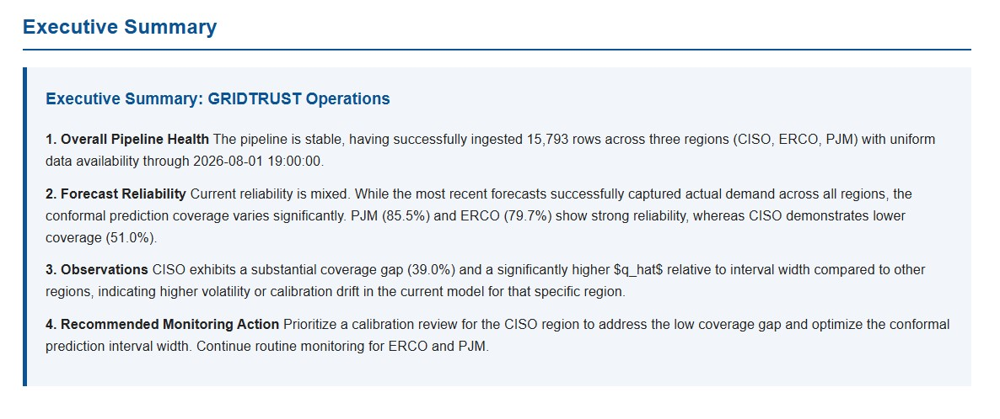

## GitHub Automation

GitHub Actions automatically executes the complete forecasting pipeline
**every Monday and Friday**.

Each scheduled run:

1.  Downloads the latest electricity demand data
2.  Updates the forecasting dataset
3.  Trains LightGBM quantile models
4.  Computes conformal prediction intervals
5.  Evaluates model performance
6.  Generates an AI executive summary
7.  Sends an HTML email report

---

## Technology Stack

Category Technologies

---

Programming Python
Database PostgreSQL
Data Processing Pandas, NumPy
Machine Learning LightGBM, Scikit-learn
Uncertainty Estimation Conformal Prediction
Dashboard Streamlit, Plotly
AI Google Gemini
Automation GitHub Actions
Version Control Git, GitHub

---

## Repository Structure

```text
src/
│
├── automation/
├── data/
├── dashboard/
├── features/
├── models/
├── notifications/
├── reporting/
└── config.py
```

---

## Installation

Clone the repository:

```bash
git clone https://github.com/ayesha-ml/gridtrust.git
cd gridtrust
```

Install dependencies:

```bash
pip install -r requirements.txt
```

Create a `.env` file:

```text
DATABASE_URL=
EIA_API_KEY=
GEMINI_API_KEY=
EMAIL_ADDRESS=
EMAIL_PASSWORD=
```

---

## Running the Project

Run the complete forecasting pipeline:

```bash
python -m src.automation.pipeline
```

Launch the dashboard:

```bash
streamlit run src/dashboard/app.py
```

---

## Results

GRIDTRUST currently forecasts electricity demand for:

- CISO
- ERCO
- PJM

Instead of evaluating only forecast accuracy, the project also measures:

- Prediction interval coverage
- Interval width
- Forecast reliability
- Model consistency over time

This provides a more realistic evaluation of forecasting performance for
operational use.

---

## Future Improvements

- Multi-day forecasting
- Weather-based features
- Automatic drift detection
- Additional electricity markets
- Cloud deployment
- Model version tracking

---

## Author

**Ayesha Amer**
